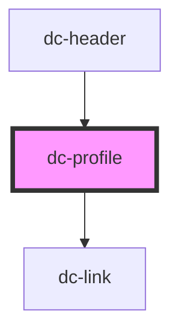

# dc-header

<!-- Auto Generated Below -->

## Properties

| Property    | Attribute   | Description                                                                                                                           | Type                                                                                                                                                   | Default     |
| ----------- | ----------- | ------------------------------------------------------------------------------------------------------------------------------------- | ------------------------------------------------------------------------------------------------------------------------------------------------------ | ----------- |
| `community` | `community` |                                                                                                                                       | `string`                                                                                                                                               | `undefined` |
| `expanded`  | `expanded`  |                                                                                                                                       | `boolean`                                                                                                                                              | `false`     |
| `homepage`  | `homepage`  |                                                                                                                                       | `string`                                                                                                                                               | `undefined` |
| `user`      | --          | An object with the user data. Follows Discourse structure as https://docs.discourse.org/#tag/Users/paths/~1users~1{username}.json/get | `{ id: number; admin: boolean; avatar_template: string; username: string; unread_notifications: number; unread_high_priority_notifications: number; }` | `undefined` |

## Events

| Event               | Description | Type                |
| ------------------- | ----------- | ------------------- |
| `toggleProfileMenu` |             | `CustomEvent<void>` |

## Dependencies

### Used by

 - [dc-header](.)

### Depends on

- [dc-link](.)

### Graph

----------------------------------------------

*Built with [StencilJS](https://stenciljs.com/)*
