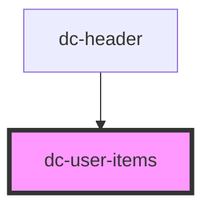

# dc-header

<!-- Auto Generated Below -->

## Properties

| Property | Attribute | Description                                                                                                                           | Type                                                                                                                                                   | Default     |
| -------- | --------- | ------------------------------------------------------------------------------------------------------------------------------------- | ------------------------------------------------------------------------------------------------------------------------------------------------------ | ----------- |
| `user`   | --        | An object with the user data. Follows Discourse structure as https://docs.discourse.org/#tag/Users/paths/~1users~1{username}.json/get | `{ id: number; admin: boolean; avatar_template: string; username: string; unread_notifications: number; unread_high_priority_notifications: number; }` | `undefined` |

## Dependencies

### Used by

 - [dc-header](.)

### Graph

----------------------------------------------

*Built with [StencilJS](https://stenciljs.com/)*
